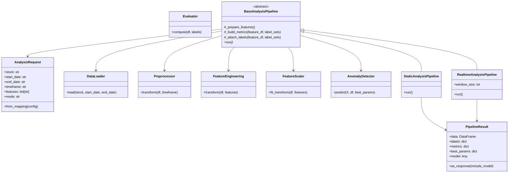
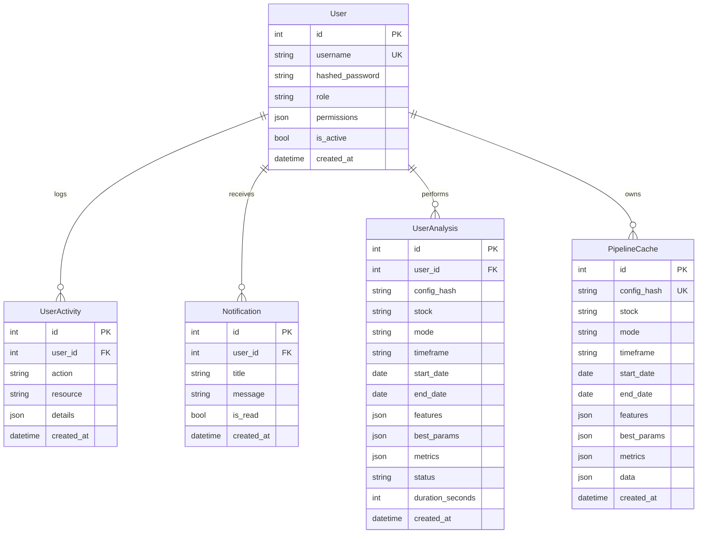

# Anomaly Engine — System Architecture

## Overview

Anomaly Engine is a distributed stock anomaly detection system with:
- **FastAPI backend** for pipeline execution, authentication, authorization, caching, and user management
- **Streamlit frontend** for interactive dashboard, visualization, and admin controls
- **SQLite database** for user management, audit trails, notifications, and result persistence

## Component Design

### Backend (FastAPI)

**Entry point:** `src/api/app.py`

#### Authentication & Authorization (`src/api/security.py`)

- JWT token-based authentication with HS256
- Password hashing using bcrypt
- Role-based access control (RBAC) with user roles: `user`, `analyst`, `admin`
- Permission-based authorization for fine-grained access control
- Default admin user created on startup

**Token flow:**
1. Client POSTs credentials to `/login`
2. Backend validates username/password against database
3. Backend returns JWT access token with user role
4. Client includes token in `Authorization: Bearer <token>` header
5. Backend decodes token, validates, and checks role permissions on protected endpoints

#### Routes

| Route | Method | Auth | Role Required | Purpose |
|-------|--------|------|---------------|---------|
| `/login` | POST | No | - | Issue JWT token |
| `/me` | GET | Yes | any | Get current user profile |
| `/me/notifications` | GET | Yes | any | Get user notifications |
| `/analyze` | POST | Yes | user+ | Run pipeline + auto-cache |
| `/cache/{hash}` | GET | Yes | user+ | Retrieve cached result |
| `/cache` | POST | Yes | user+ | Save result explicitly |
| `/cache/{hash}` | DELETE | Yes | admin | Delete cached result |
| `/users` | GET | Yes | admin | List all users |
| `/users` | POST | Yes | admin | Create new user |
| `/users/{id}/role` | PATCH | Yes | admin | Update user role |
| `/users/{id}` | DELETE | Yes | admin | Delete user |
| `/users/{id}/activity` | GET | Yes | admin | Get user activity log |

#### Database Models (`src/api/models.py`)

**User**
- `id` (PK)
- `username` (unique)
- `hashed_password`
- `role` (user/analyst/admin)
- `permissions` (JSON dict for fine-grained permissions)
- `is_active`
- `created_at`

**UserActivity**
- `id` (PK)
- `user_id` (FK to User)
- `action` (login, analyze, etc.)
- `resource` (endpoint or object affected)
- `details` (JSON metadata)
- `created_at`

**Notification**
- `id` (PK)
- `user_id` (FK to User)
- `title`
- `message`
- `type`
- `is_read`
- `read_at`
- `created_at`

**UserAnalysis**
- `id` (PK)
- `user_id` (FK to User)
- `config_hash`
- `stock`, `mode`, `timeframe`, `start_date`, `end_date`
- `features` (JSON)
- `best_params` (JSON)
- `metrics` (JSON)
- `status` (success/error)
- `duration_seconds`
- `executed_at`

**PipelineCache**
- `id` (PK)
- `config_hash` (unique) — SHA256 of config JSON
- `stock`, `mode`, `timeframe`, `start_date`, `end_date`
- `features` (JSON)
- `best_params` (JSON)
- `metrics` (JSON)
- `data` (JSON) — full result dataframe as list of dicts
- `created_at`

### Artifact persistence & favorites (new)

The system now persists the full analysis payload (metrics, data, best_params) to disk as a gzipped JSON artifact under `artifacts/results/{user_id}/{config_hash}.json.gz`. The `UserAnalysis` model stores a `data_path` string pointing to that file for retrieval and auditing.

Key points:
- Artifacts are written on every analysis run (cache miss or new run) to avoid storing large JSON blobs directly in the database.
- The `UserAnalysis` record now includes `data_path` and `is_favorite` (boolean) fields:
    - `data_path`: filesystem path to gzipped JSON artifact
    - `is_favorite`: user-controlled flag for marking important analyses
- API endpoints added:
    - `GET /me/analyses` — list a user's analyses
    - `GET /me/analyses/{id}/data` — download artifact JSON for a specific analysis (validates ownership)
    - `POST /me/analyses/{id}/favorite` — set/unset favorite (body: `{ "favorite": true }`)

Security and operational notes:
- Artifact files are stored within the project workspace under `artifacts/results/` by default. For production, consider moving artifacts to object storage (S3/GCS) with access controls and lifecycle policies.
- Because artifacts can be large, the DB only stores metadata (`data_path`, metrics, best_params) and not the full JSON payload.
- Implement retention/cleanup policies to bound disk usage (e.g., purge artifacts older than N days or keep only favorites).
#### Pipeline Execution

When `/analyze` is called:

1. **Validate** request against `AnalyzeConfig` schema
2. **Log activity** — record analysis attempt in `user_activity` table
3. **Hash** the config to generate `config_hash`
4. **Check cache** in `pipeline_cache` table
   - If hit: return cached data
   - If miss: continue
5. **Load hyperparams** from `artifacts/hyperparams/{stock}.json`
6. **Execute pipeline** (static or realtime mode)
    - `StaticAnalysisPipeline` via `run_pipeline()` for static analysis
    - `RealtimeAnalysisPipeline` via `run_realtime_pipeline()` for rolling-window simulation
7. **Serialize results** to JSON (convert DataFrame, handle pandas Timestamps)
8. **Save to cache** in database
9. **Log analysis** — record completion in `user_analysis` table
10. **Create notification** — notify user of analysis completion
11. **Return** results to client

#### Caching Strategy

- **Config hash** is deterministic SHA256 of `{stock, mode, timeframe, start_date, end_date, features, best_params}`
- Same config = same hash = cache hit
- Cache is per-user (JWT token validates ownership implicitly; can be extended)
- Manual cache write via `/cache` POST for explicit control
- Admin can delete cache entries via `/cache/{hash}` DELETE

#### User Management & Audit

- **Role-based access**: `user` (basic analysis), `analyst` (extended features), `admin` (full system control)
- **Activity logging**: All user actions logged to `user_activity` table for audit trails
- **Notifications**: System-generated notifications for important events (analysis complete, errors, admin actions)
- **Admin controls**: Create/update/delete users, view activity logs, manage cache

#### Notification System

- **Triggers**: Analysis completion, system errors, admin user management actions
- **Delivery**: Stored in database, retrieved via `/me/notifications`
- **Management**: Mark as read, automatic cleanup of old notifications

### Frontend (Streamlit)

**Entry point:** `main.py`

#### Session State

```python
st.session_state["authenticated"]  # Boolean
st.session_state["auth_token"]     # JWT string
st.session_state["username"]       # Username string
st.session_state["role"]           # User role (user/analyst/admin)
st.session_state["results"]        # Analysis results dict
```

#### Flow

1. **Login check** — if not authenticated, show login form
2. **API login** — POST credentials to backend, store token and role
3. **Role-based UI** — show appropriate controls based on user role
4. **Dashboard** — show analysis controls (stock, date range, timeframe, mode)
5. **Analysis** — POST analysis config to `/analyze`, get results
6. **Cache save** — POST results to `/cache` (non-blocking, warnings only)
7. **Visualization** — render plots using Plotly
8. **Admin panel** — if admin role, show user management interface
9. **Notifications** — display unread notifications in sidebar

#### API Integration (`main.py` functions)

- `login(username, password)` — Call `/login`, store token and role
- `logout()` — Clear session state
- `get_user_profile()` — Call `/me` for current user info
- `get_notifications()` — Call `/me/notifications` for user alerts
- `analyze_via_api(payload)` — Call `/analyze`, handle errors
- `save_cache_via_api(payload, results)` — Call `/cache` to persist
- `get_all_users()` — Admin: list all users
- `create_user_via_api()` — Admin: create new user
- `update_user_role_via_api()` — Admin: change user role
- `delete_user_via_api()` — Admin: remove user

### Data Pipeline

The pipeline layer is organized around `src/pipelines/analysis_engine.py`.

**Core classes**
- `AnalysisRequest` — normalized in-memory representation of the API payload
- `DataLoader` — loads processed symbol data from disk (class-based service)
- `Preprocessor` — resamples and cleans OHLCV data (class-based service)
- `FeatureEngineering` — builds returns, volatility, SMA, RSI, and Bollinger Bands (class-based service)
- `FeatureScaler` — fits and applies scaling to selected features (class-based service)
- `Evaluator` — computes anomaly metrics and statistics (class-based service)
- `AnomalyDetector` / `AnomalyDetectorService` — produces DBSCAN, Isolation Forest, and z-score labels
- `StaticAnalysisPipeline` — runs a full historical analysis pass
- `RealtimeAnalysisPipeline` — runs a rolling-window simulation using the same services

**Static mode**
- Load historical data for the requested date range
- Preprocess the raw frame
- Engineer features and scale the requested columns
- Produce labels for DBSCAN, Isolation Forest, and z-score detectors
- Compute per-detector anomaly metrics

**Realtime mode**
- Load and preprocess the requested data range
- Engineer features once, then simulate a rolling window
- Re-run detector predictions per step and capture the latest cluster label
- Return the annotated time series with an `anomaly` marker column

### Pipeline Class Diagram



### Visualization

**Plotly-based** (`src/components/visualization.py`)

- `plot_analysis()` — Price + technical indicators (SMA, RSI, Bollinger Bands)
- `plot_scatter()` — Price vs. volume, colored by cluster (-1 = anomaly)
- `plot_timeseries()` — Price line with anomaly markers

## Database Schema (ER Diagram)



```
┌─────────────────┐
│  Streamlit UI   │
│  (Login +       │
│   Dashboard +   │
│   Admin Panel)  │
└────────┬────────┘
         │ 1. POST /login (username, password)
         ▼
┌─────────────────────────────────────────┐
│         FastAPI Backend                 │
│  ┌──────────────────────────────────┐  │
│  │ 1. Validate credentials          │  │
│  │ 2. Generate JWT token + role     │  │
│  │ 3. Return token to Streamlit     │  │
│  └──────────────────────────────────┘  │
│  ┌──────────────────────────────────┐  │
│  │ POST /analyze                    │  │
│  │ 1. Check role permissions        │  │
│  │ 2. Log activity to UserActivity  │  │
│  │ 3. Hash config → cache_key       │  │
│  │ 4. Lookup in PipelineCache DB    │  │
│  │ 5. If miss: Run pipeline()       │  │
│  │ 6. Save to cache                 │  │
│  │ 7. Log to UserAnalysis           │  │
│  │ 8. Create Notification           │  │
│  │ 9. Return {metrics, data}        │  │
│  └──────────────────────────────────┘  │
│  ┌──────────────────────────────────┐  │
│  │ Admin Endpoints                  │  │
│  │ - GET/POST/DELETE /users         │  │
│  │ - PATCH /users/{id}/role         │  │
│  │ - GET /users/{id}/activity       │  │
│  │ - DELETE /cache/{hash}           │  │
│  └──────────────────────────────────┘  │
│              ▲                          │
│              │ 2. JWT in header         │
└──────────────┼──────────────────────────┘
               │
         ┌─────┴──────┐
         │            │
         ▼            ▼
    ┌────────────┐  ┌──────────────────────┐
    │ Hyperparams│  │   SQLite DB          │
    │ JSON files │  │ (Users, Cache,       │
    │            │  │  Activity, Analysis, │
    │            │  │  Notifications)      │
    └────────────┘  └──────────────────────┘
```

## Security Considerations

### Authentication & Authorization
- JWT tokens expire after `ACCESS_TOKEN_EXPIRE_MINUTES` (default 60 minutes)
- Passwords hashed with bcrypt (12 rounds, direct implementation)
- Role-based access control with three levels: `user`, `analyst`, `admin`
- Permission-based fine-grained access control via JSON permissions field
- Default admin credentials should be changed in production

### Audit & Monitoring
- All user actions logged to `user_activity` table for compliance
- Analysis attempts and completions tracked in `user_analysis` table
- System notifications for important events and errors
- Admin can view user activity logs and manage users

### Data Protection
- Cache is stored in plaintext in SQLite (not encrypted)
- In production, consider encrypting sensitive columns or using encrypted database
- Cache hash is deterministic; users can't forge cache entries (JWT prevents tampering)
- User passwords are properly hashed; never stored in plaintext

### API Access
- All sensitive endpoints require JWT authentication
- Role-based route protection prevents unauthorized access
- Admin-only endpoints for user management and system control
- Input validation via Pydantic schemas prevents injection attacks
- All pipeline endpoints require valid JWT
- Database queries are parameterized (SQLAlchemy ORM prevents SQL injection)
- CORS not enabled; assumes same-origin deployment

## Scalability & Production Notes

### Database Scaling
- **SQLite** is fine for single-user / small team
- **PostgreSQL** recommended for multi-user production
  - Update `SQLALCHEMY_DATABASE_URL` in `src/api/database.py`
  - Install `psycopg2-binary`

### Backend Scaling
- **Development:** `uvicorn src.api.app:app --reload`
- **Production:** Use Gunicorn with Uvicorn workers
  ```bash
  gunicorn -w 4 -k uvicorn.workers.UvicornWorker src.api.app:app
  ```

### Frontend Deployment
- Streamlit Cloud, AWS EC2, or Docker
- Set `API_URL` environment variable or hardcode in `main.py`
- Consider Nginx reverse proxy for HTTPS

### Environment Variables
Consider using `.env` file (via `python-dotenv`):
```
DATABASE_URL=sqlite:///anomaly_engine.db
SECRET_KEY=<your-secret-key>
API_URL=http://localhost:8000
```

## Extension Points

### Adding a new user endpoint
```python
@app.post("/users", response_model=schemas.UserRead)
def create_user(request: schemas.UserCreate, db: Session = Depends(database.get_db), current_user: models.User = Depends(get_current_user)):
    # Only admin can create users
    if current_user.username != "admin":
        raise HTTPException(status_code=403, detail="Forbidden")
    return crud.create_user(db, request.username, request.password)
```

### Changing the ML model
1. Extend or replace `StaticAnalysisPipeline` and `RealtimeAnalysisPipeline` in `src/pipelines/analysis_engine.py`
2. Update feature engineering in `src/components/feature_engineering.py`
3. Adjust schema/frontend visualization as needed

### Adding caching invalidation
```python
@app.delete("/cache/{config_hash}")
def invalidate_cache(config_hash: str, db: Session = Depends(database.get_db)):
    db.query(models.PipelineCache).filter(models.PipelineCache.config_hash == config_hash).delete()
    db.commit()
    return {"status": "deleted"}
```

## Testing

Run syntax checks:
```bash
python -m py_compile main.py src/api/app.py src/api/crud.py
```

Test backend startup:
```bash
uvicorn src.api.app:app --reload &
curl http://localhost:8000/login -X POST -d "username=admin&password=admin123"
```

Test frontend:
```bash
streamlit run main.py
# Navigate to http://localhost:8501 and test login flow
```

## Troubleshooting

### "Incorrect username or password"
- Check database: `sqlite3 anomaly_engine.db "SELECT * FROM users;"`
- Ensure default user exists or create one manually

### Cache not working
- Verify database file is writable
- Check that same config is used (hash must match)
- Inspect `PipelineCache` table for entries

### API timeout
- Increase Streamlit timeout: `timeout=600` in `requests.post()`
- Optimize pipeline (reduce data, features, or model complexity)
