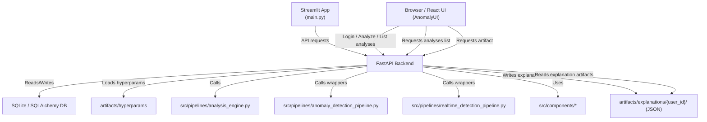
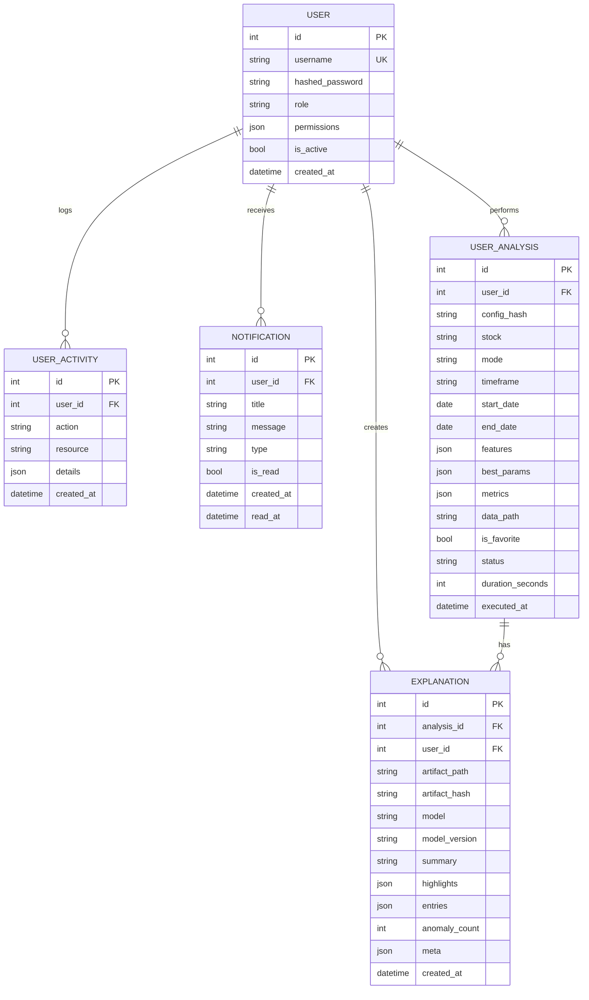

# System Diagram Documentation

This document describes the diagrams recommended for the Anomaly Engine project, what each diagram should show, and why each is useful.

## Recommended Diagrams

1. Component Diagram
2. Data Flow Diagram (DFD)
3. Sequence Diagram
4. Activity Diagram
5. ER Diagram
6. Deployment Diagram (optional)

---

## 1. Component Diagram

### Purpose

Shows the major application pieces and how they connect.

### What to include

- Streamlit frontend (`main.py`)
- FastAPI backend (`src/api/app.py`)
- SQLite database (`src/api/database.py`, `src/api/models.py`)
- Pipeline modules (`src/pipelines/`)
- Feature engineering / visualization modules (`src/components/`)
- Config and hyperparameter files (`configs/`, `artifacts/hyperparams/`)

### Why it matters

It gives a high-level architecture overview for developers and stakeholders.

---

## 2. Data Flow Diagram (DFD)

### Purpose

Shows how data moves through the system.

### What to include

- User login request from Streamlit to FastAPI (`/login`)
- Token issuance with role and return
- User profile requests (`/me`, `/me/notifications`)
- Analysis request from Streamlit to `/analyze`
- Role/permission validation
- Activity logging to `UserActivity`
- Cache lookup in SQLite
- Pipeline execution when cache misses
- Analysis logging to `UserAnalysis`
- Notification creation
- Response returned to Streamlit
- Admin user management flows (`/users` endpoints)
- Cache management (`/cache` endpoints)

### Why it matters

It clarifies how information travels and where decisions are taken.

---

## 3. Sequence Diagram

*** End Patch
---

## Updated diagrams (artifact persistence & favorites)

The system now persists full analysis artifacts (gzipped JSON) to the workspace under `artifacts/results/{user_id}/{config_hash}.json.gz` and records the file path in `UserAnalysis.data_path`. Users can mark important analyses with `UserAnalysis.is_favorite` which is exposed by the API and surfaced in the UI.

### Updated Component Diagram (summary)

### Explanation Artifact Persistence (Update - June 2026)

Add the following to component/data-flow diagrams:

- Explanation generation: `/analyze/explain` endpoint -> `ai_services` -> produces explanation JSON
- Artifact storage: explanation JSON written to `artifacts/explanations/{user_id}/explanation_<uuid>.json`
- Hashing: Backend computes SHA256 over the stable JSON dump and stores the digest as `artifact_hash` for integrity and deduplication
- DB history: A lightweight `explanations` DB table stores `artifact_path`, `artifact_hash`, `summary`, `highlights`, `anomaly_count`, `user_id`, `created_at` and minimal `metadata` (e.g., request summary)
- UI behaviour: The UI shows a history list (not full content). To view full content, the UI may fetch the artifact file via an API route that reads the JSON file.

Update your ER diagram to add an `explanations` table with attributes: `id`, `analysis_id` (FK), `user_id` (FK), `artifact_path`, `artifact_hash`, `summary`, `highlights`, `anomaly_count`, `metadata`, `created_at`.

If you maintain a visual deployment diagram, show `Artifacts Storage` (disk) and the `SQLite DB` with the lightweight `explanations` table.

### Report-ready ER Diagram

This ER diagram is suitable to include in a technical report. It lists primary keys (PK), foreign keys (FK), and attributes relevant for compliance and data retention reviews.

Notes:
- `ARTIFACT_STORE` in the ER above was a conceptual placeholder representing files on disk. The project now uses a concrete `explanations` table (lightweight history) and explanation JSON files on disk under `artifacts/explanations/{user_id}/`. The DB stores `artifact_path` and `artifact_hash` plus minimal metadata for listing and deduplication.

