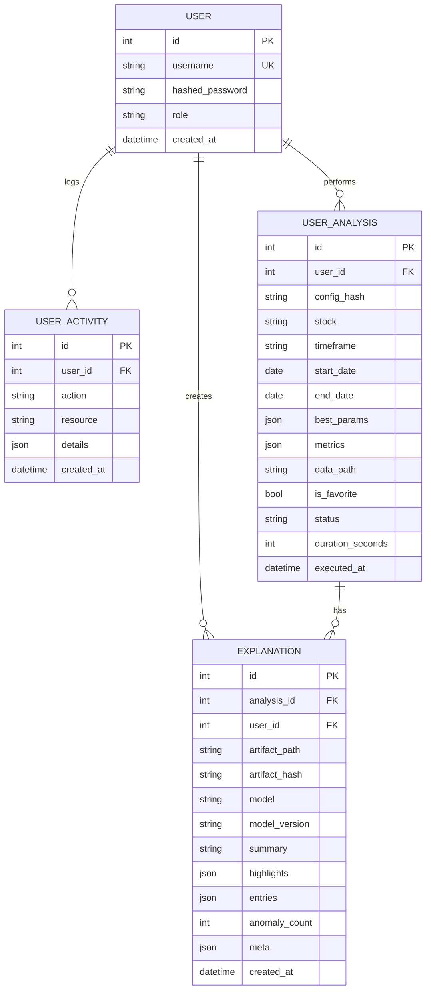
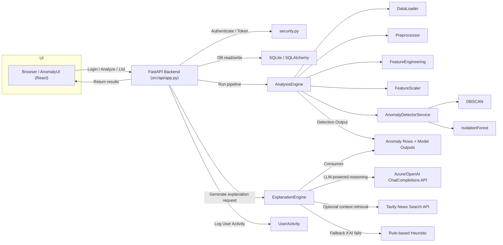
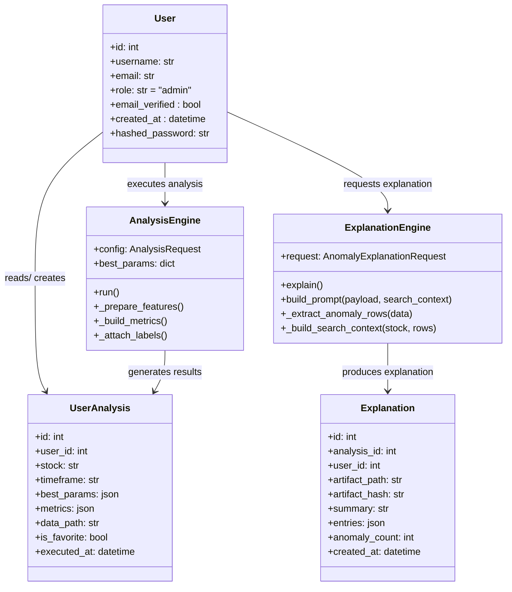
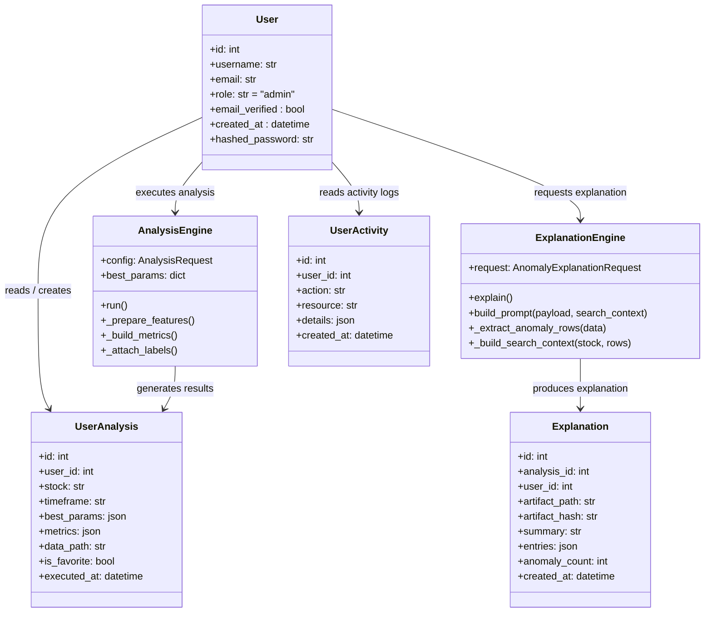
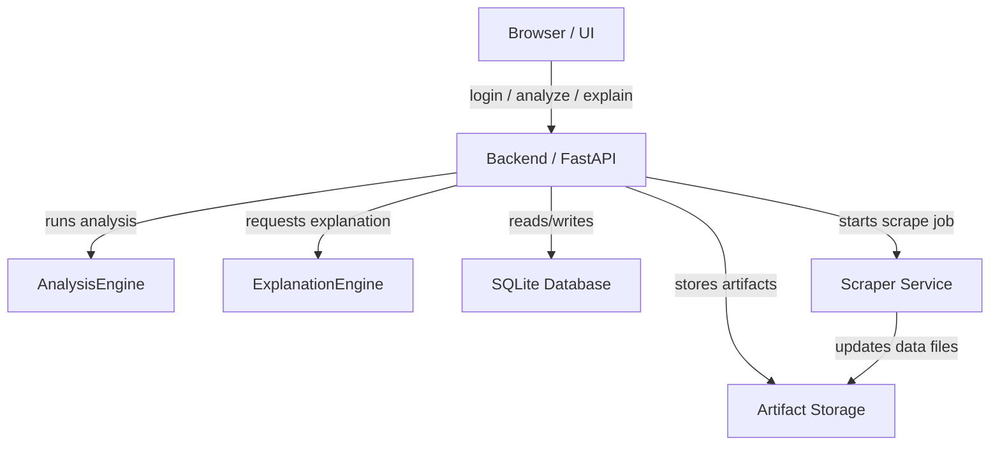
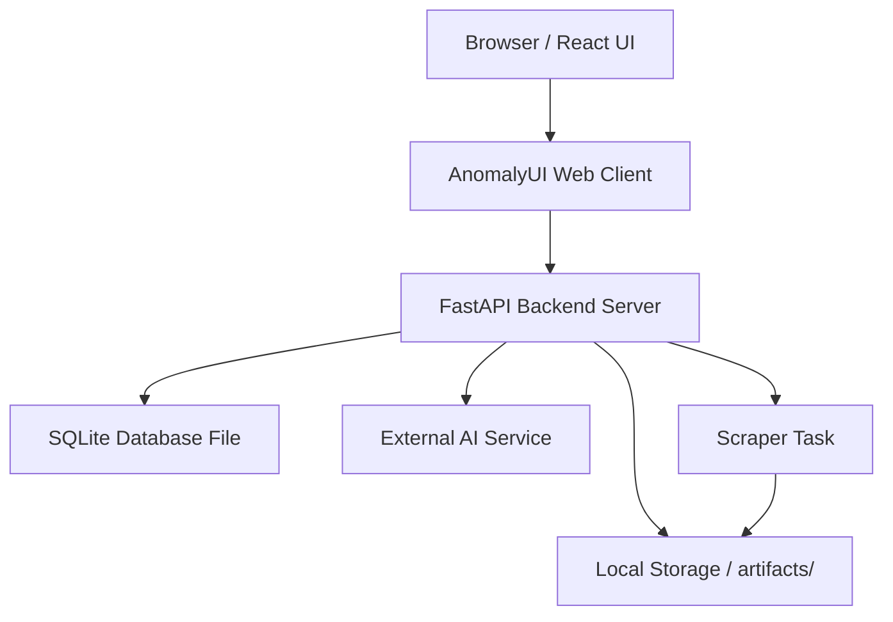
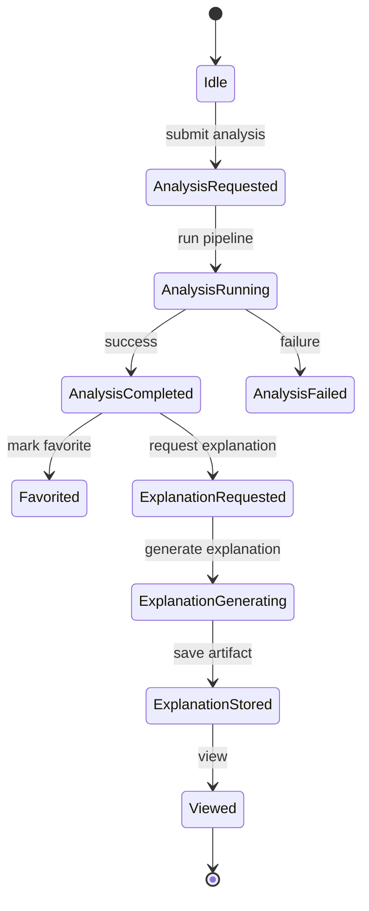
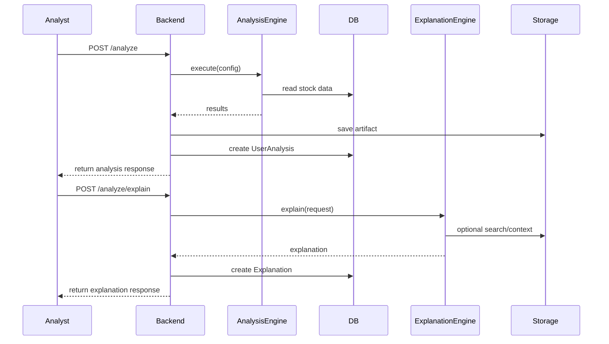
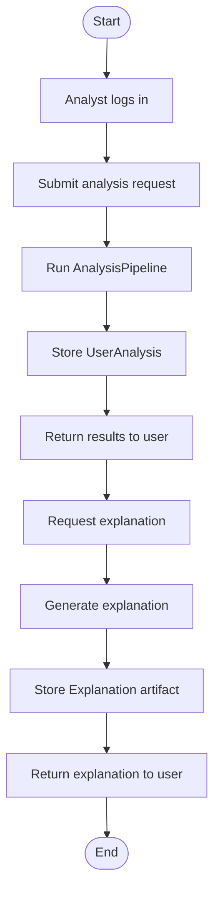

# System Diagram Documentation

This document describes the diagrams recommended for the Anomaly Engine project, what each diagram should show, and why each is useful.

## Recommended Diagrams

1. Component Diagram
2. Data Flow Diagram (DFD)
3. Sequence Diagram
4. Activity Diagram
5. ER Diagram
6. Deployment Diagram (optional)


### Report-ready ER Diagram

This ER diagram is suitable to include in a technical report. It lists primary keys (PK), foreign keys (FK), and attributes relevant for compliance and data retention reviews.



## System Flowchart (Mermaid) 2026-06-07

This flowchart shows the high-level runtime interactions between the UI, API, pipeline engine, storage and auxiliary services.



Note: Z-Score is included as an optional side analysis feature in the flowchart. The main anomaly detection path is through `DBSCAN` and `IsolationForest`, with AI explanation context enriched by the News API.

Refer to the other diagrams in this document for more detailed component, sequence and ER diagrams.


## 7. Class Diagrams

### 7.1 Analyst Class Diagram



### 7.2 Admin Class Diagram



## 8. Component Diagram



## 9. Deployment Diagram



## 10. Object Diagram

```mermaid
objectDiagram
    object analyst : Analyst {
        id: 1
        username: "analyst_user"
        role: "analyst"
    }
    object analysisEngine : AnalysisEngine {
        config: {stock: "SBI", timeframe: "1D"}
    }
    object explanationEngine : ExplanationEngine {
        request: {stock: "SBI", timeframe: "1D"}
    }
    object userAnalysis : UserAnalysis {
        id: 101
        stock: "SBI"
        is_favorite: false
    }
    object explanation : Explanation {
        id: 201
        anomaly_count: 3
    }

    analyst --> analysisEngine
    analyst --> explanationEngine
    analysisEngine --> userAnalysis
    explanationEngine --> explanation
```

## 11. State Diagram



## 12. Sequence Diagram



## 13. Activity Diagram



