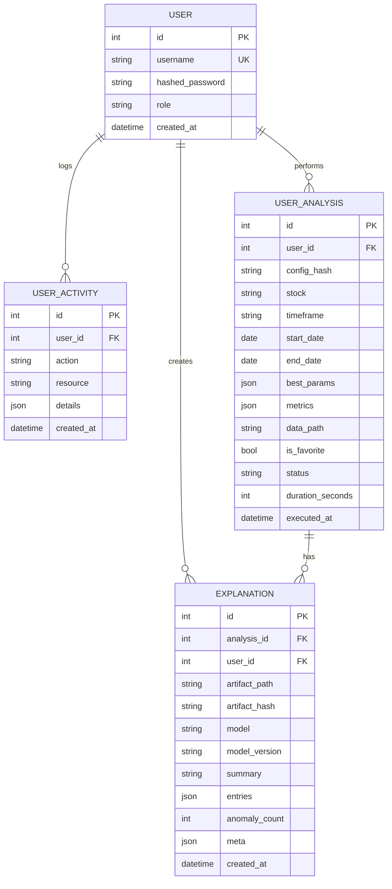
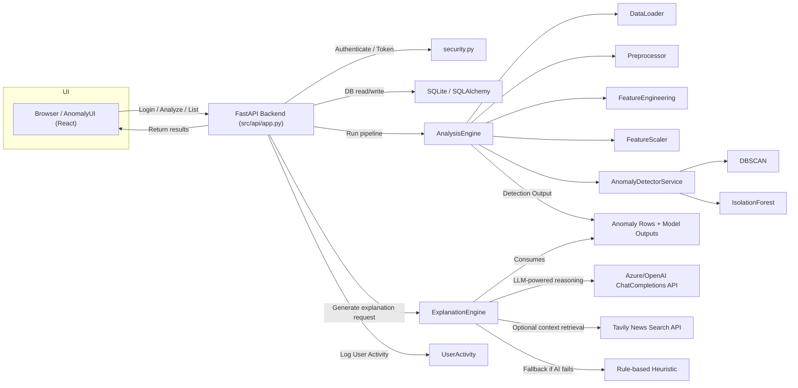
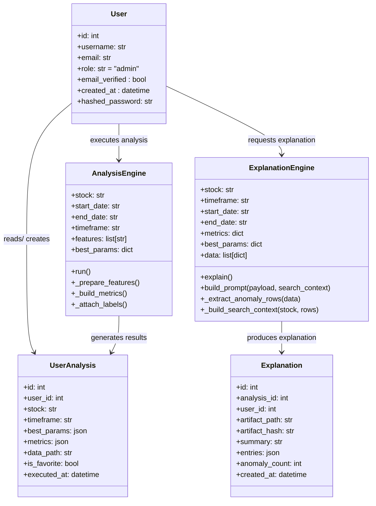
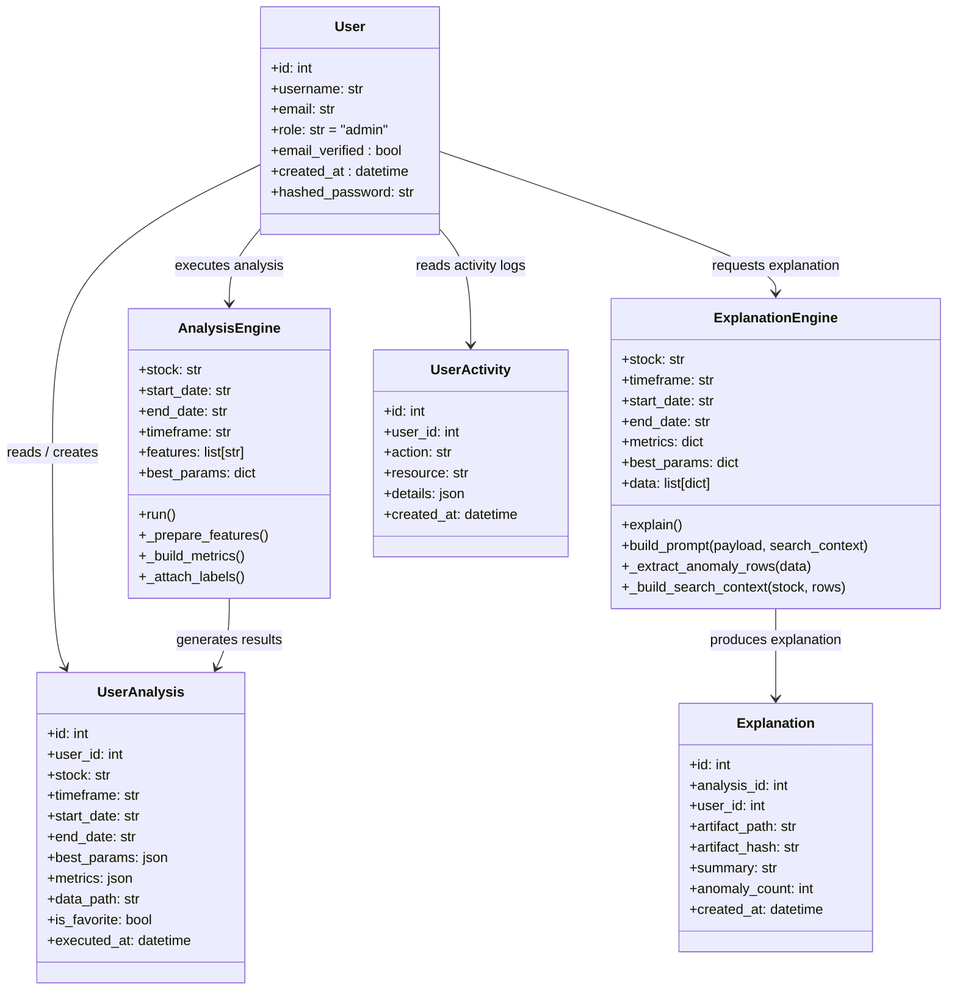
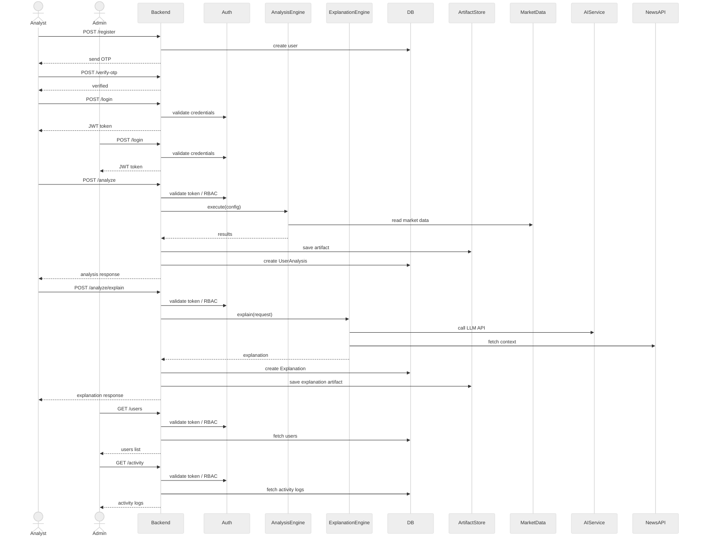

# System Diagram Documentation

This document describes the diagrams recommended for the Anomaly Engine project, what each diagram should show, and why each is useful.

### Report-ready ER Diagram

This ER diagram is suitable to include in a technical report. It lists primary keys (PK), foreign keys (FK), and attributes relevant for compliance and data retention reviews.

## System Flowchart (Mermaid) 2026-06-07

This flowchart shows the high-level runtime interactions between the UI, API, pipeline engine, storage and auxiliary services.

Note: Z-Score is included as an optional side analysis feature in the flowchart. The main anomaly detection path is through `DBSCAN` and `IsolationForest`, with AI explanation context enriched by the News API.

Refer to the other diagrams in this document for more detailed component, sequence and ER diagrams.

## 7. Class Diagrams

### 7.1 Analyst Class Diagram

### 7.2 Admin Class Diagram

## 8. Component Diagram

This PlantUML component diagram models the core Anomaly Engine subsystems and shows that the market data scraper is orchestrated by a GitHub workflow runner, not by the FastAPI backend.
@startuml
left to right direction
skinparam componentStyle uml2
skinparam linetype ortho
skinparam nodesep 150
skinparam ranksep 250
skinparam padding 20

package "Frontend" {
  [Login / Registration Page] as LoginPage
  [Analysis Dashboard] as AnalysisPage
  [Results Viewer] as ResultsPage
  [AI Explanation Panel] as ExplanationPanel
  [History / Past Analyses Page] as HistoryPage
  [Admin Dashboard] as AdminDashboard
  [API Client] as ApiClient
}
package "Backend" {
  [FastAPI Backend] as API
  [Authentication & RBAC] as Auth
  [Analysis Engine] as Analysis
  [Explanation Engine] as Explanation
  [User Management] as UserMgmt
  [Activity Logger] as Activity
}
database "SQLite Database" as DB
folder "Local Disk / artifacts" as ArtifactStore
folder "Market Data CSV Store" as CSVStore
cloud "External AI Service" as AIService
cloud "News API" as NewsAPI
node "GitHub Actions Runner" as GitHubWorkflow

LoginPage -down-> ApiClient : submit credentials / OTP
AnalysisPage --> ApiClient : request analysis
ResultsPage --> ApiClient : retrieve results
ExplanationPanel --> ApiClient : request explanation
HistoryPage --> ApiClient : request past analyses
AdminDashboard --> ApiClient : request admin endpoints
ApiClient --> API : HTTPS / REST
API --> Analysis : execute pipeline
API --> Auth : token validation, RBAC
API --> Explanation : generate anomaly explanation
API --> UserMgmt : create/update/delete users
API --> Activity : record audit events
API --> DB : persist users, analyses, cache, activity logs
API --> ArtifactStore : save/read artifacts
Analysis --> CSVStore : read market csv data
GitHubWorkflow -right-> CSVStore : scheduled data scraping
Explanation --> AIService : call LLM API
Explanation --> NewsAPI : context enrichment
@enduml

@startuml
left to right direction
skinparam componentStyle uml2
skinparam linetype ortho

package "Frontend" {
  [Login / Registration Page] as LoginPage
  [Analysis Dashboard] as AnalysisPage
  [Results Viewer] as ResultsPage
  [AI Explanation Panel] as ExplanationPanel
  [History / Past Analyses Page] as HistoryPage
  [Admin Dashboard] as AdminDashboard
  [API Client] as ApiClient
}
package "Backend" {
  [FastAPI Backend] as API
  [Authentication & RBAC] as Auth
  [Analysis Engine] as Analysis
  [Explanation Engine] as Explanation
  [User Management] as UserMgmt
  [Activity Logger] as Activity
}
database "Database" as DB
folder "Artifact Store" as ArtifactStore
folder "Market Datastore" as CSVStore
cloud "External AI Service" as AIService
cloud "News API" as NewsAPI
node "GitHub Actions Runner" as GitHubWorkflow

LoginPage --> ApiClient
AnalysisPage --> ApiClient
ResultsPage --> ApiClient
ExplanationPanel --> ApiClient
HistoryPage --> ApiClient
AdminDashboard --> ApiClient
ApiClient --> API
API --> Analysis
API --> Auth
API --> Explanation
API --> UserMgmt
API --> Activity
API --> DB
API --> ArtifactStore
Analysis --> CSVStore
GitHubWorkflow -right-> CSVStore
Explanation --> AIService
Explanation --> NewsAPI
@enduml

@startuml
skinparam componentStyle uml2
skinparam linetype ortho
skinparam nodesep 150
skinparam ranksep 250
skinparam padding 20

package "Presentation Layer (React + Vite)" {
  [Auth Pages\nLogin, Register, Profile] as AuthPages
  [Analysis Pages\nDashboard, Analysis Form, Results, Charts] as AnalysisPages
  [Admin Pages\nUser Management, Activity Log, Data Browser] as AdminPages
}

package "API Layer (FastAPI)" {
  [Auth API\nPOST /login, /register*, GET] as AuthAPI
  [Analysis API\nPOST /analyze, /analyze/{id}\nGET /symbols, /ma/analysis] as AnalysisAPI
  [Admin API\nCRUD /admin/users\nPOST /admin/scrape, GET /admin/data*] as AdminAPI
}

package "Service Layer" {
  [Auth Service\nJWT create/decode\nbcrypt hashing, OTP] as AuthService
  [Analysis Engine\nPipeline orchestrator\ncache check, artifact I/O] as AnalysisEngine
  [Explanation Engine\nAI (Azure OpenAI + Tavily)\nor Heuristic fallback] as ExplanationEngine
  [Admin Service\nUser CRUD, activity audit\ndata listing] as AdminService
}
package "Infrastructure Layer" {
  [Web Scraper\nShareSansar daily\nprice data scraper] as WebScraper
  [SQLite Database\nSQLAlchemy ORM\nUsers, Analyses, Cache, Explanations] as DB
  [File System\nGzipped JSON artifacts\nCSV data files, Hyperparameter JSON] as FileSystem
  [External APIs\nAzure OpenAI, Tavily\nWeb Search, Gmail SMTP] as ExternalAPIs
}

package "Domain Layer" {
  [DBSCAN\nDensity-based clustering\neps + min_pts] as DBSCAN
  [Isolation Forest\nTree-based isolation\nn_trees + contamination] as IsolationForest
  [Z-Score\nStatistical deviation\nthreshold] as ZScore
  [Feature Engineering\nReturns, Volatility, RSI\nSMA, Bollinger Bands] as FeatureEng
}

AuthPages --> AuthAPI
AnalysisPages --> AnalysisAPI
AdminPages --> AdminAPI

"Presentation Layer (React + Vite)" -down-> "API Layer (FastAPI)" : HTTP Requests

AuthAPI --> AuthService
AnalysisAPI --> AnalysisEngine
AdminAPI --> AdminService

"API Layer (FastAPI)" -down-> "Service Layer" : Delegates to

"Service Layer" -down-> "Domain Layer" : Uses
"Service Layer" -down-> "Infrastructure Layer" : Reads/Writes

AnalysisEngine --> DBSCAN
AnalysisEngine --> IsolationForest
AnalysisEngine --> ZScore
AnalysisEngine --> FeatureEng

AuthService --> DB
AnalysisEngine --> DB
AdminService --> DB
AnalysisEngine --> FileSystem
ExplanationEngine --> ExternalAPIs

WebScraper -right-> FileSystem : Appends CSV

@enduml

## 9. Use Case Diagram

This use case diagram shows the primary actors and their main interactions with the Anomaly Engine system.

@startuml
left to right direction

actor Analyst
actor Admin
actor "Share Sansar" as SS

rectangle "Anomaly Engine" {

    (Register)
    (Login)
    (Verify OTP)

    (Collect market data)

    (Submit analysis request)
    (View analysis results)
    (Request AI explanation)
    (View past analyses)
    (Manage users)
    (View activity log)

    SS --> (Collect market data)

    Analyst --> (Register)
    Analyst --> (Login)
    Analyst --> (Submit analysis request)
    Analyst --> (View analysis results)
    Analyst --> (View past analyses)

    Admin --> (Register)
    Admin --> (Login)
    Admin --> (Submit analysis request)
    Admin --> (View analysis results)
    Admin --> (View past analyses)
    Admin --> (Manage users)
    Admin --> (View activity log)

    (Request AI explanation) ..> (View analysis results) : <<extend>>

    (Register) ..> (Verify OTP) : <<include>>
    (Login) ..> (Verify OTP) : <<include>>
}

@enduml

## 10. Deployment Diagram

This PlantUML deployment diagram shows the runtime nodes, persistent storage, and the separate GitHub workflow scraper that maintains the market data pipeline independently from the live FastAPI service.

@startuml
left to right direction
skinparam componentStyle uml2

node "Analyst Browser" as AnalystNode {
  component "AnomalyUI Web Client" as WebClient
}

node "Admin Browser" as AdminNode {
  component "Admin UI" as AdminUI
}

node "Backend Host" as BackendNode {
  component "FastAPI Server" as FastAPIApp
}

database "SQLite Database" as SQLiteDB
folder "Local Disk / artifact store" as ArtifactFS
folder "Market Data Store" as MarketDataFS
cloud "External AI Service" as AIService
node "GitHub Actions Runner" as GitHubRunner

AnalystNode --> WebClient : load UI
AdminNode --> AdminUI : load UI
WebClient --> FastAPIApp : HTTPS REST
AdminUI --> FastAPIApp : HTTPS REST
FastAPIApp --> SQLiteDB : SQL queries
FastAPIApp --> ArtifactFS : save/read artifacts
FastAPIApp --> MarketDataFS : read market CSV data
FastAPIApp --> AIService : HTTP/JSON requests
GitHubRunner --> MarketDataFS : scheduled scrape writes
GitHubRunner --> ArtifactFS : optional scrape logs

note bottom: GitHub Actions runner executes scheduled scraper jobs independently of the FastAPI backend.
@enduml

## 10. Object Diagram

    @startuml
    left to right direction
    
    skinparam padding 10
    skinparam shadowing false
    skinparam linetype ortho
    top to bottom direction
    skinparam nodesep 50
    skinparam ranksep 80
    
    
    skinparam shadowing false
    skinparam linetype ortho
    
    object "analyst1 : User" as analyst1 {
      id = 1
      username = analyst_user
      email = analyst@example.com
      role = analyst
      email_verified = true
      created_at = 2025-06-01T10:00:00
      hashed_password = $2b$12$L2fC
    }
    
    object "admin1 : User" as admin1 {
      id = 2
      username = admin
      email = admin@example.com
      role = admin
      email_verified = true
      created_at = 2025-01-01T08:00:00
      hashed_password = $2b$4s2L2t5
    }
    
    object "analysisEngine : AnalysisEngine" as analysisEngine {
      stock = ADBL
      start_date = 2025-06-09
      end_date = 2026-06-09
      timeframe = 1D
      features = [close,volume,returns,volatility]
      best_params = {n_estimators:200}
    }
    
    object "explanationEngine : ExplanationEngine" as explanationEngine {
      stock = ADBL
      timeframe = 1D
      start_date = 2025-05-01
      end_date = 2025-05-31
       metrics = {anomaly_rate: 0.02, n_noise: 2}
    
      data = [{date: 2026-06-09, close: 314.5}]
    }
    
    object "analysis1 : UserAnalysis" as analysis1 {
      id = 101
      user_id = 1
      stock = API
      timeframe = 1D
      start_date = 2025-05-01
      end_date = 2025-05-31
      best_params = {contamination: 0.05}
      metrics = {anomaly_rate: 0.02, n_noise: 2}
      data_path = /artifacts/user_1/abc123.json
      is_favorite = true
      executed_at = 2025-06-01T12:00:00
    }
    
    object "explanation1 : Explanation" as explanation1 {
      id = 201
      analysis_id = 101
      user_id = 1
      model = openai/gpt-4.1
      artifact_path = /artifacts/exp_201.json
      artifact_hash = def45632
      summary = Volume spiked detected
      anomaly_count = 5
      created_at = 2025-06-01T12:01:00
    }
    
    object "activity1 : UserActivity" as activity1 {
      id = 301
      user_id = 2
      username = admin
      action = explanation_generated
          resource = CHCL
      details = {"analysis_id": "5"}
      created_at = 2025-06-01T12:05:00
    }
    
    analyst1 --> analysisEngine : executes
    analysisEngine --> analysis1 : generates
    
    analyst1 --> explanationEngine : requests
    explanationEngine --> explanation1 : produces
    
    analyst1 --> analysis1 : owns
    analyst1 --> explanation1 : owns
    
    admin1 --> activity1 : reviews
    admin1 --> analysis1 : monitors
    @enduml

## 11. State Diagram

stateDiagram-v2
    [*] --> Unauthenticated
    Unauthenticated --> OTPPending : register / login
    OTPPending --> Authenticated : verify OTP
    Authenticated --> Idle : session started
    Idle --> AnalysisRequested : submit analysis
    AnalysisRequested --> AnalysisCompleted : success
    AnalysisRequested --> AnalysisFailed : failure
    AnalysisCompleted --> Favorited : mark favorite
    AnalysisCompleted --> ExplanationRequested : request explanation
    ExplanationRequested --> ExplanationStored : save artifact
    ExplanationStored --> Viewed : view
    Viewed --> Idle
    Idle --> [*] : logout

stateDiagram-v2
    [*] --> Unauthenticated
    Unauthenticated --> OTPPending : register / login
    OTPPending --> Authenticated : verify OTP
    Authenticated --> Idle : session started
    Idle --> AnalysisRequested : submit analysis
    AnalysisRequested --> AnalysisCompleted : success
    AnalysisRequested --> AnalysisFailed : failure
    AnalysisCompleted --> Favorited : mark favorite
    AnalysisCompleted --> ExplanationRequested : request explanation
    ExplanationRequested --> ExplanationStored : save artifact
    ExplanationStored --> Viewed : view
    Viewed --> Idle
    Idle --> ManagingUsers : manage users
    ManagingUsers --> Idle : done
    Idle --> ViewingActivityLog : view activity log
    ViewingActivityLog --> Idle : done
    Idle --> [*] : logout

## 12. Sequence Diagram

