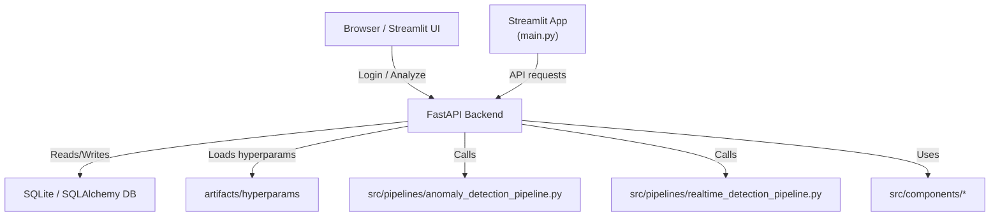
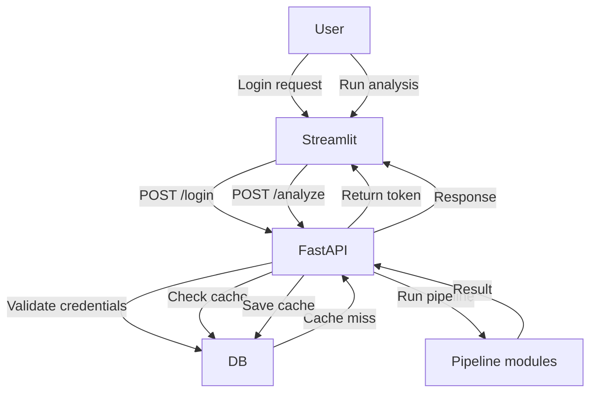
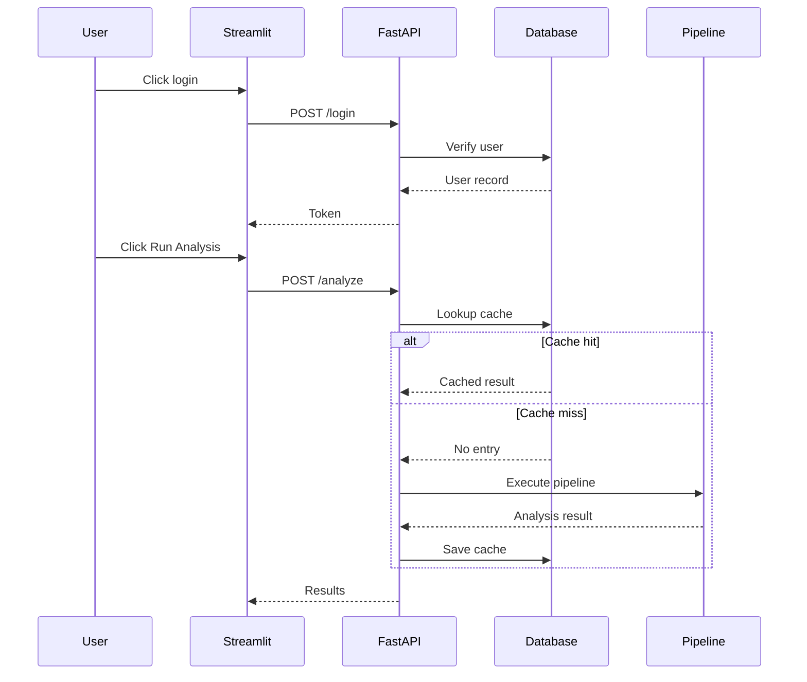
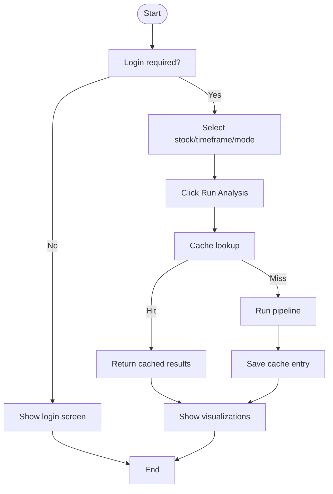
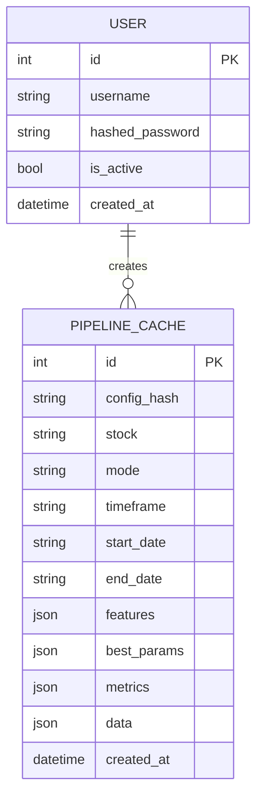

# System Diagram Documentation

This document describes the diagrams recommended for the Anomaly Engine project, what each diagram should show, and why each is useful.

## Recommended Diagrams

1. Component Diagram
2. Data Flow Diagram (DFD)
3. Sequence Diagram
4. Activity Diagram
5. ER Diagram
6. Deployment Diagram (optional)

---

## 1. Component Diagram

### Purpose

Shows the major application pieces and how they connect.

### What to include

- Streamlit frontend (`main.py`)
- FastAPI backend (`src/api/app.py`)
- SQLite database (`src/api/database.py`, `src/api/models.py`)
- Pipeline modules (`src/pipelines/`)
- Feature engineering / visualization modules (`src/components/`)
- Config and hyperparameter files (`configs/`, `artifacts/hyperparams/`)

### Why it matters

It gives a high-level architecture overview for developers and stakeholders.

---

## 2. Data Flow Diagram (DFD)

### Purpose

Shows how data moves through the system.

### What to include

- User login request from Streamlit to FastAPI
- Token issuance and return
- Analysis request from Streamlit to `/analyze`
- Cache lookup in SQLite
- Pipeline execution when cache misses
- Response returned to Streamlit
- Explicit cache write flow to `/cache`

### Why it matters

It clarifies how information travels and where decisions are taken.

---

## 3. Sequence Diagram

### Purpose

Shows runtime interaction and ordering between components.

### Recommended flows

- Login flow
- Analyze flow with cache hit
- Analyze flow with cache miss
- Logout flow

### Why it matters

It makes the exact request/response sequence easy to understand.

---

## 4. Activity Diagram

### Purpose

Shows the steps and decision points within a process.

### Recommended processes

- "Run Analysis" workflow
- Cache decision path: hit vs miss
- Realtime simulation flow

### Why it matters

It helps document conditional behavior and control flow.

---

## 5. ER Diagram

### Purpose

Models the database entities and relationships.

### What to include

- `User` table
  - `id`
  - `username`
  - `hashed_password`
  - `is_active`
  - `created_at`
- `PipelineCache` table
  - `id`
  - `config_hash`
  - `stock`
  - `mode`
  - `timeframe`
  - `start_date`
  - `end_date`
  - `features`
  - `best_params`
  - `metrics`
  - `data`
  - `created_at`

### Why it matters

An ER diagram is about data, not object-oriented programming. It is appropriate because the project stores and retrieves structured data in a database.

### Why it is not tied to OOP

- ER diagrams describe entities, attributes, and relationships.
- They are used for database design and data modeling.
- You can use them for any system that persists data, regardless of whether the code uses classes or functional style.

---

## 6. Deployment Diagram (optional)

### Purpose

Shows how the software is deployed and where each component runs.

### What to include

- User browser / client
- Streamlit host
- FastAPI host
- SQLite or other database host
- Optional reverse proxy / Docker

### Why it matters

It helps plan deployment and understand infrastructure requirements.

---

## How to use this documentation

- Use the Component Diagram for architecture reviews.
- Use the DFD for data movement and caching logic.
- Use Sequence Diagrams for request/response order.
- Use Activity Diagrams for workflows and decision points.
- Use ER Diagrams for database modeling.
- Use Deployment Diagrams if you need infrastructure documentation.

## Diagram tools

You can create these diagrams using any of the following:

- Mermaid
- Draw.io / diagrams.net
- Lucidchart
- PlantUML
- Microsoft Visio

---

## Mermaid Diagram Examples

### Component Diagram

### Data Flow Diagram (DFD)

### Sequence Diagram

### Activity Diagram

### ER Diagram

> Note: the ER diagram uses a simple relationship for illustration. In this project the cache entries are not strictly owned by a single user yet, but the data model is still useful to document how database entities are structured.

---

## Notes

This project uses a relational data store for auth and caching, so ER diagrams are relevant even though the application code is not strictly object-oriented. The ER diagram documents the data model behind the FastAPI backend.
